# Ver o Tempo ⏰ — o tempo que dá pra ver

**Um app gratuito que mostra a rotina da manhã e da noite como uma fita colorida, para crianças que ainda não sabem ler as horas no relógio.**

Cada tarefa (acordar, tomar café, escovar os dentes, trocar de roupa…) vira um bloco colorido. Quanto mais longa a tarefa, maior o bloco. Um marcador **AGORA** anda pela fita no ritmo do relógio. Assim a criança vê onde está, o que vem depois e quanto tempo ainda tem, sem precisar perguntar "falta muito?".

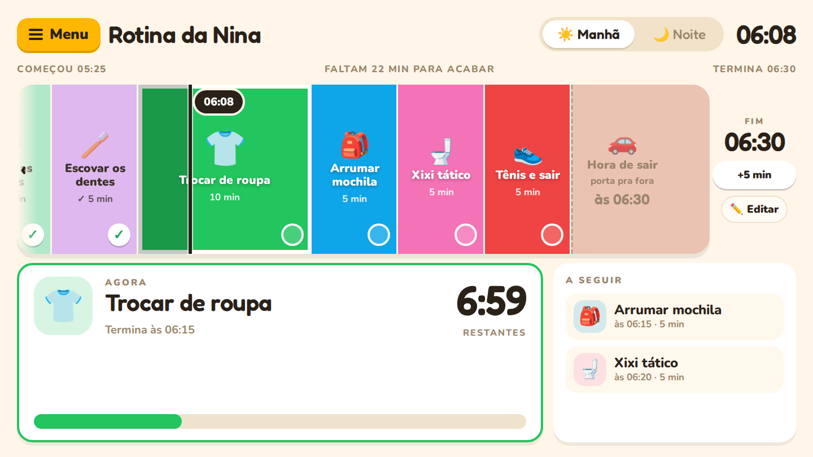

---

## 💛 Por que isso ajuda

Manhãs e noites com crianças costumam ser uma corrida: "já escovou os dentes?", "anda, que a gente vai se atrasar!", "cinco minutinhos pra dormir…". O problema é que, para uma criança pequena, **o tempo é invisível**. "Dez minutos" não quer dizer nada para quem ainda não entende o relógio.

Este app transforma o tempo em algo que dá para **ver**:

- **Tempo vira espaço.** Um bloco grande quer dizer tempo de sobra; um bloco estreito quer dizer que é rápido. A criança entende isso de olhar, sem ler números.
- **Menos bronca, mais autonomia.** Quem avisa que está na hora é a fita, não o adulto. A criança olha para a tela e sabe sozinha o que fazer.
- **Nada de surpresa.** Saber o que vem depois deixa as mudanças de atividade mais tranquilas, o que ajuda muito crianças que sofrem com transições.
- **Conquistas à vista.** Cada tarefa terminada ganha um ✓ e fica mais clarinha. Dá para ver o quanto já foi feito.
- **Serve para toda a família.** Os adultos também enxergam de relance se a manhã está no horário ou atrasada.

---

## 👀 O que aparece na tela

### A fita
Todas as tarefas da rotina, em ordem, cada uma com emoji, nome e duração.

- Tarefas **já feitas** ficam claras e ganham um ✓.
- A **tarefa de agora** tem uma borda branca e vai escurecendo aos poucos conforme o tempo passa.
- A linha **AGORA** mostra exatamente onde vocês estão.

### O cartão AGORA
Um cartão grande diz **o que fazer agora** e **quanto tempo falta** (por exemplo, `2:26`). Nos **últimos 2 minutos** ele fica vermelho e avisa: **"⏰ Quase acabando — corre!"**

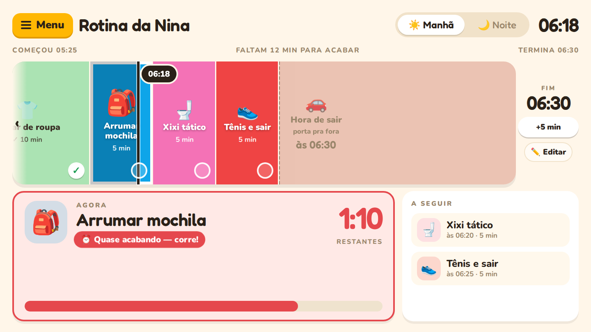

### A seguir
Ao lado, as **próximas duas tarefas** e a hora em que cada uma começa.

### E se passar da hora?
Sem drama. No fim da fita existe um espaço de encerramento: **"Hora de sair" 🚗** de manhã e **"Hora de dormir" 🛏️** à noite.

Se o horário acabar e ainda faltar alguma coisa, o app **mantém o encerramento por até três horas após o prazo**. O espaço de encerramento acende e mostra com calma onde vocês deveriam estar ("É hora de estar saindo pra escola — se ainda falta algo, pega no caminho"). O cartão mostra há quanto tempo passou da hora (`+16:48`). Após essa janela, o plano passa para a próxima ocorrência. Você também pode tocar em **↺ Recomeçar**.

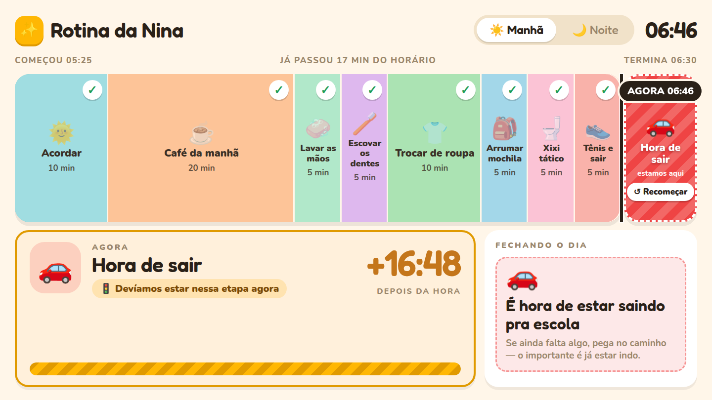

### O horário final sempre à vista
O fim da rotina mostra **a que horas ela termina**: no celular, no marco final fixo no rodapé ("Hora de dormir · ÀS 21:00"), junto do **+5 min** e do **✏️** (quando a rotina acaba ou passa da hora, ele acende e diz "estamos aqui"); na TV e no computador, em destaque (**FIM 06:30**) logo acima do botão **+5 min**. Ao tocar em **+5 min**, ou ao mudar o horário no modo de edição, o número muda na hora.

### Na TV ou no celular
O app se ajusta sozinho à tela:

- **TV, computador ou tablet deitado:** a fita fica na horizontal, com letras grandes para ler do outro lado da cozinha.
- **Celular ou tablet em pé:** a fita fica na vertical e rola sozinha para acompanhar a tarefa de agora. Você pode rolar com o dedo para ver as outras tarefas; depois de alguns segundos ela volta a acompanhar. Só a lista de tarefas rola: o cabeçalho (☰, manhã/noite, relógio), o cartão AGORA e o rodapé com o horário final, **+5 min** e **✏️** ficam sempre dentro da tela, mesmo com avisos abertos.

<p>
  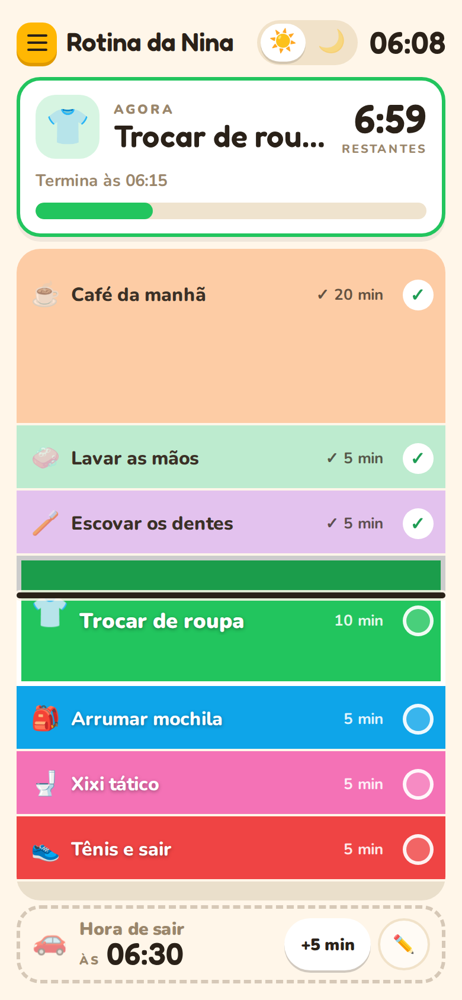
  &nbsp;&nbsp;
  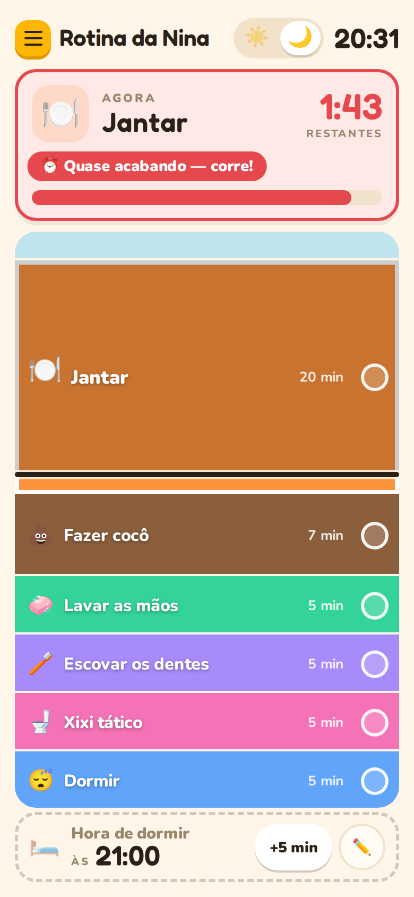
</p>

---

## 🧭 Como usar no dia a dia

1. **Abra o app** na TV, no tablet ou no celular. Ele começa na rotina da **manhã** (☀️). Toque em **🌙** para ver a rotina da **noite**.
2. **Deixe a tela onde a criança possa ver**: na cozinha, perto da mesa do café, no corredor do banheiro…
3. **Pronto.** A fita anda sozinha, seguindo o relógio. É só acompanhar.

### Se vocês estiverem adiantados ou atrasados
Toque no bloco da tarefa que vocês estão fazendo **agora**. O app entende "estamos aqui" e ajusta o horário de término para essa tarefa começar neste momento.

### ✏️ Editar a rotina na própria tela
No uso normal a tela fica limpa: só aparece um botão discreto **✏️** (no celular, no rodapé ao lado de **+5 min**; na TV, **✏️ Editar** abaixo de **+5 min**). Ao tocar nele, a rotina que está na tela entra no **modo de edição**:

<p>
  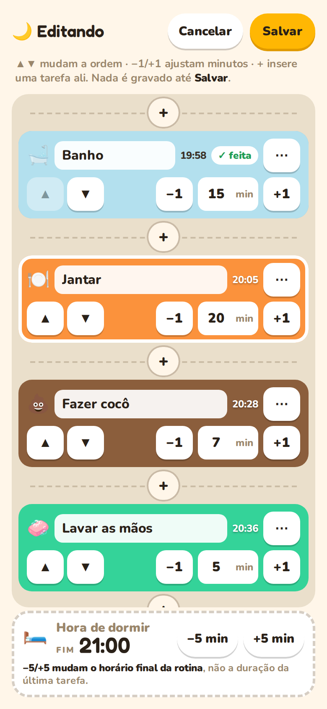
  &nbsp;&nbsp;
  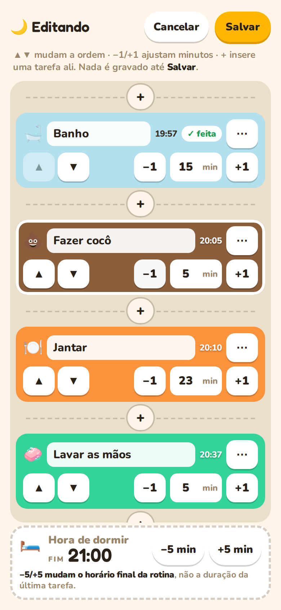
</p>

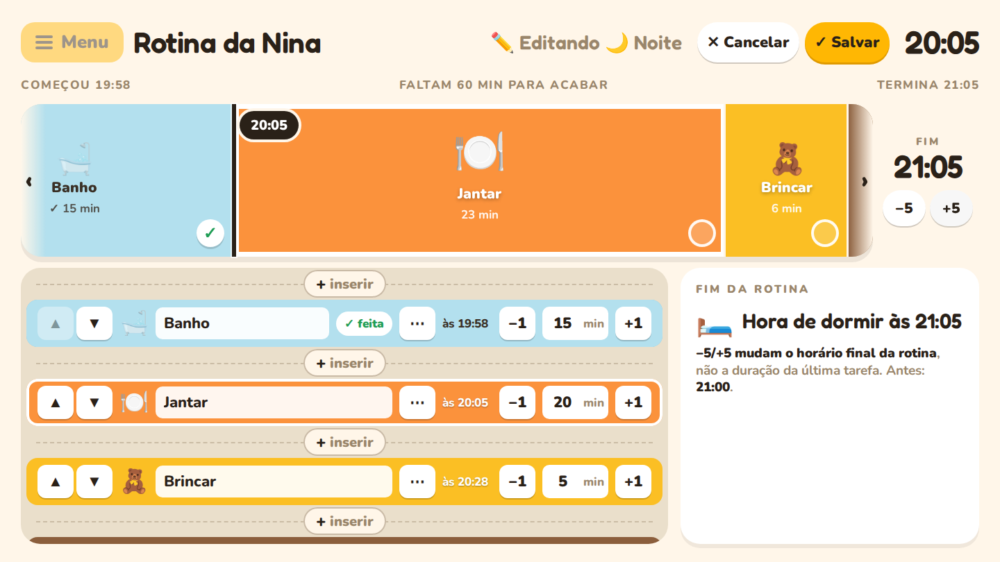

Tudo o que você mexe é um **rascunho**: a fita mostra a prévia na hora, mas nada é gravado até você tocar em **Salvar**.

- **Salvar** grava de uma vez no aparelho e atualiza o link da barra (veja abaixo).
- **Cancelar** descarta tudo o que foi mexido (ordem, minutos, tarefas novas, nomes e horário final) e volta ao uso normal, sem gravar nada.
- Enquanto edita, o menu ☰, os ✓, o "pular para" e o +5 normal ficam pausados, para não haver duas edições ao mesmo tempo.
- As tarefas já marcadas com ✓ **continuam marcadas** depois de mudar a ordem, os minutos, inserir tarefas ou mudar o horário final; cada marca acompanha a sua tarefa.

**Exemplo — mudar a ordem.** Na noite, "Fazer cocô" vem depois do "Jantar" e você quer antes: toque em **✏️**, depois em **▲** na linha de "Fazer cocô". Cada toque troca a tarefa com a vizinha; o **▲** da primeira e o **▼** da última ficam desativados. Se tocar várias vezes no mesmo lugar, a lista acompanha a tarefa, que continua debaixo do dedo (ou à vista, quando a lista chega ao fim). Toque em **Salvar**.

**Exemplo — ajustar a duração.** O jantar está levando mais tempo: toque em **+1** na linha do "Jantar" três vezes (20 → 23 min). O número no meio mostra a duração e também pode ser digitado. **−1** para em 1 minuto (o botão fica desativado). Os horários de início das tarefas ("20:10", "20:37"…) são recalculados na prévia.

**Regra da duração:** toda tarefa tem um número **inteiro de 1 a 180 minutos**. Se você digitar algo fora disso (0, um número negativo, campo vazio, 2,5 ou 181), o campo fica vermelho, aparece o aviso "Duração inválida em … Use um número inteiro de 1 a 180 minutos" e **Salvar fica desativado** até corrigir — nada é gravado. Corrija digitando um valor válido ou tocando em −1/+1 (que partem do último valor válido), ou toque em **Cancelar**. A mesma regra vale na caixa de nova tarefa/⋯ (**Adicionar tarefa** e **Aplicar** ficam desativados) e no editor completo **⚙️ Rotinas** (**Salvar Alterações** fica desativado).

**Exemplo — inserir uma tarefa entre duas.** Entre cada par de tarefas (e no começo e no fim) há um **+**. Toque no **+** entre "Escovar os dentes" e "Xixi tático": abre uma caixa "Nova tarefa — Entre Escovar os dentes e Xixi tático". Escolha uma sugestão (por exemplo **📚 Ler livro**) ou digite um nome, ajuste ícone, cor e minutos e toque em **Adicionar tarefa**. Ela entra exatamente ali. No **⋯** de cada linha dá para trocar ícone e cor ou remover a tarefa.

<p>
  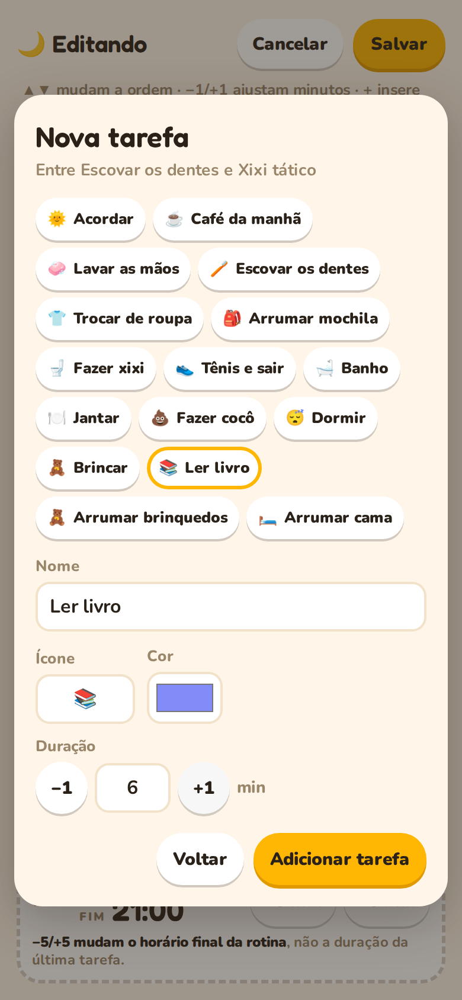
  &nbsp;&nbsp;
  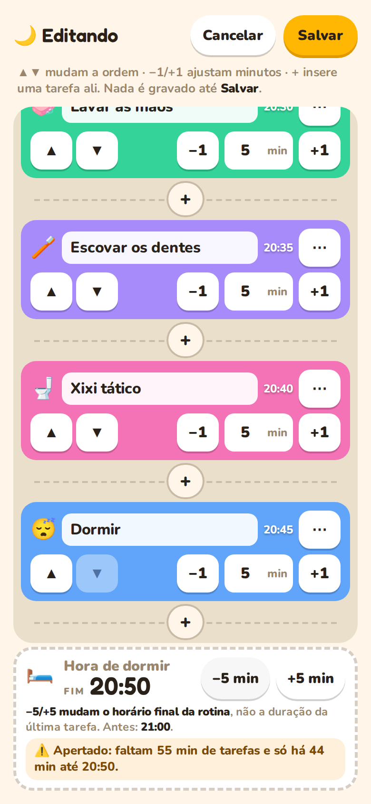
</p>

**Exemplo — mudar o horário final.** No modo de edição, o marco final mostra **−5 min** e **+5 min**. Eles mudam **a hora em que a rotina termina** (o horário final, por exemplo de 21:00 para 20:50), **não** a duração da última tarefa. O app mostra o horário anterior ("Antes: 21:00") e avisa quando:

- **⚠️ Apertado:** o que falta das tarefas não cabe até o novo horário (ex.: "faltam 55 min de tarefas e só há 44 min até 20:50");
- **⏰ Já passou:** o horário final ficou no passado (por exemplo, editando depois da hora); use +5.

O **−5** fica desativado quando levaria o fim para um horário que já passou. Ao salvar, o novo horário passa a valer para a rotina e vai para o link. Já o **+5 min** do uso normal continua igual: dá mais 5 minutos só para esta vez, sem mudar a rotina salva nem o link.

### Menu dos adultos (o botão ☰)
Os ajustes completos ficam atrás do botão amarelo **☰** (na TV e no computador, **☰ Menu**), ao lado do nome do app:

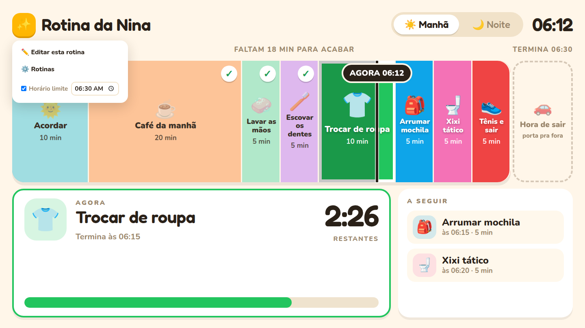

- **✏️ Editar esta rotina:** abre o mesmo modo de edição do botão ✏️ (veja acima).
- **⚙️ Rotinas:** o editor completo, com todas as rotinas e o horário em que cada uma deve terminar. Também tem **Cancelar** e **Salvar Alterações**, e as setas da primeira e da última tarefa ficam desativadas.
  - **Excluir Rotina** (manhã ou noite): depois de confirmar, descarta a rotina personalizada daquele período e volta à **rotina padrão original do aplicativo** (por exemplo, a noite volta às 7 tarefas com fim às 21:00). A outra rotina não muda. Como o resto do editor, só vale depois de **Salvar Alterações**; **Cancelar** desfaz. Se era a rotina na tela, a rodada atual recomeça (as marcas ✓ eram da rotina excluída). Isso não é um "padrão pessoal": o app não guarda outra versão sua para voltar.
  - Uma rotina sem nenhuma tarefa não pode ser salva (aqui ou no modo de edição).
- **Dados antigos:** se o aparelho tiver dados de uma versão anterior em que a rotina da manhã ou da noite foi excluída (ou ficou sem tarefas), o app mostra a rotina padrão original daquele período com um aviso, sem apagar nem alterar nada. Toque em **✏️** e **Salvar** para guardá-la; a outra rotina continua como estava.
- **Horário limite:** a hora em que a rotina precisa acabar (por exemplo, a hora de sair para a escola). O app calcula de trás para frente quando cada tarefa deve começar.

As mudanças ficam guardadas **no próprio aparelho**, no navegador. Ao salvar (no modo de edição ou no editor completo), o link da barra é atualizado sem recarregar: copie e guarde esse novo endereço para reabrir ou compartilhar tarefas, ordem, durações, nomes e horário final. No menu, use **Salvar horário** para incluir o prazo no link. As marcas ✓ não vão para o link: elas valem só para o momento.

### Configuração por URL

Abra um link como `/?rotina=1.n.ba-20.ja-25.ma-de-5.1930` para carregar tarefas simples ou combinadas, ordem, minutos e final opcional. Os atalhos `/0720` e `/1930` abrem o padrão da manhã/noite com esse horário final. Consulte o [guia completo para gerar links de rotina](docs/url-rotina.md), com catálogo, exemplos e regras de edição e recarga.

### Dicas para funcionar melhor
- **Comece com poucas tarefas.** Quatro ou cinco já fazem diferença. Dá para aumentar depois.
- **Deixe a criança escolher** os emojis e as cores das tarefas dela. Ela vai se sentir dona da rotina.
- **Use durações realistas.** Se o café sempre leva 25 minutos, coloque 25, não 15.
- **Comemore os ✓.** Chegar ao "Hora de sair" com tudo feito é uma vitória!

---

## 💻 Como instalar

Há dois jeitos de usar o app:

- **Versão publicada (HTTPS), quando houver uma.** O projeto já está preparado para ser publicado como site estático (Cloudflare Workers Static Assets; veja [Implantação](#implantação-cloudflare-workers-static-assets-fase-3)). Este README não indica um endereço público. Em uma versão de produção em HTTPS, basta abrir o endereço no navegador, sem computador da casa ligado, e dá para **instalar como app** (PWA) no Android, no iPhone/iPad ou no computador. Ela funciona **sem internet** só depois de uma primeira visita completa com internet e de recarregar a página uma vez; a primeira visita offline não funciona. Veja o [guia de instalação, offline e atualização](docs/pwa.md).
- **No seu computador (modo local), descrito abaixo.** Você instala uma vez e depois abre na TV, no tablet ou no celular pela rede Wi-Fi. Nesse modo o computador precisa ficar ligado, e o `npm start` não instala o app nem funciona offline (o modo de desenvolvimento não registra o service worker).

As rotinas ficam guardadas **por endereço**: o que você salvou em `localhost` ou no endereço da rede local não aparece automaticamente na versão publicada (nem o contrário). Para levar uma rotina, use o link de rotina (veja [Configuração por URL](#configuração-por-url)).

### PELO TERMINAL

Para quem já tem [Git](https://git-scm.com/) e [Node.js](https://nodejs.org/) (22.23.3 LTS, conforme `.nvmrc`) instalados:

```bash
git clone https://github.com/gutogarrote/ver-o-tempo.git
cd ver-o-tempo/app
npm ci
npm start
```

O app abre em **http://localhost:3000**. Para usar na TV ou no celular (na mesma rede Wi-Fi), use o endereço **Network** que o `npm start` mostra, por exemplo `http://192.168.0.15:3000`.

### OU ENTÃO

Não é preciso saber programar: basta seguir os passos.

#### 1. Instale o Node.js (só na primeira vez)
O Node.js é um programa gratuito que faz o app funcionar.

1. Entre em **[nodejs.org](https://nodejs.org/)**.
2. Baixe a versão **22.23.3 LTS** e instale como qualquer outro programa (pode ir clicando em "Avançar"/"Continuar").

#### 2. Baixe o app
1. Na [página do projeto no GitHub](https://github.com/gutogarrote/ver-o-tempo), clique no botão verde **`<> Code`** e depois em **Download ZIP**.
2. Descompacte o arquivo baixado numa pasta fácil de achar, como **Documentos**.
3. Dentro dela haverá uma pasta chamada **`app`**. É essa que importa.

#### 3. Abra o "terminal" dentro da pasta `app`
O terminal é uma janela onde se digitam comandos. Não se assuste: são só dois.

- **Windows:** abra a pasta `app` no Explorador de Arquivos, clique na barra de endereço lá em cima, apague o que estiver escrito, digite `cmd` e aperte **Enter**.
- **Mac:** abra o app **Terminal**, digite `cd` seguido de um espaço, **arraste a pasta `app`** para dentro da janela e aperte **Enter**.

#### 4. Instale e ligue o app
No terminal, digite o comando abaixo e aperte **Enter**. Ele baixa o que o app precisa e só é necessário na primeira vez; pode levar alguns minutos.

```
npm ci
```

Quando terminar, digite:

```
npm start
```

Abra **http://localhost:3000** no navegador.

> Se o Windows perguntar se o Node.js pode usar a rede, clique em **Permitir**. Isso é o que deixa a TV e o celular abrirem o app.

#### 5. Abra na TV, no tablet ou no celular
Depois do `npm start`, o terminal mostra algo assim:

```
  Local:   http://localhost:3000
  Network: http://192.168.0.15:3000
```

Com o aparelho **na mesma rede Wi-Fi** do computador, abra o navegador dele e digite o endereço da linha **Network** (o número será diferente na sua casa). Numa smart TV, use o navegador da própria TV.

#### Das próximas vezes
Basta abrir o terminal na pasta `app` (passo 3) e digitar `npm start`. No modo local, o computador precisa ficar ligado, com a janela do terminal aberta, enquanto vocês usam o app. Para desligar, feche a janela do terminal (ou aperte **Ctrl + C** nela).

---

## 🚧 O que ainda não tem

Este é um projeto em andamento. Por enquanto:

- **Sons de aviso ainda não tocam.** Os avisos sonoros ("faltam 5 minutos", "falta 1 minuto", "tarefa concluída") estão planejados, mas ainda não funcionam.
- **Uma rotina de manhã e uma de noite, iguais todos os dias.** Ainda não dá para ter rotinas diferentes para cada dia da semana (por exemplo, sábado sem escola).
- **Cada aparelho guarda suas próprias mudanças.** Se você editar a rotina no celular, a TV não fica sabendo. Faça as mudanças no aparelho que fica à vista da criança.
- **Sem endereço público neste README.** Sem uma versão publicada em HTTPS, o app roda no modo local, que precisa de um computador ligado (veja "Como instalar"). Uma versão publicada não precisa dele e pode ser instalada e usada offline, conforme o [guia PWA](docs/pwa.md).

## 🔒 Privacidade

O app não tem cadastro, login ou backend de rotinas. As configurações ficam no navegador de cada aparelho (e de cada endereço). As fontes Nunito e Fredoka vêm junto com o app, servidas pelo próprio site (licenças SIL OFL 1.1 em [`app/src/assets/fonts/`](app/src/assets/fonts/README.md)); nenhuma chamada ao Google Fonts é feita. Um link compartilhado pode expor os nomes e horários que transporta.

## 🙏 De onde veio

Este é o repositório do [ver-o-tempo](https://github.com/gutogarrote/ver-o-tempo), um app para visualizar o tempo em rotinas com crianças. A interface foi redesenhada para ficar mais clara, mais divertida e fácil de ler de longe.

*Quer mexer no código?* Veja [`app/CHANGES.MD`](app/CHANGES.MD) e [`CLAUDE.md`](CLAUDE.md) para detalhes técnicos.

---

## 🇺🇸 Summary (English)

**Rotina** is a free web app that shows your family's morning and bedtime routines as a colorful timeline, made for kids who can't read a clock yet.

- Each task (wake up, breakfast, brush teeth, get dressed…) is a colored block sized by how long it takes. A **NOW** marker moves along in real time.
- A big card shows the current task and a countdown. It turns red in the last 2 minutes and lists what's coming next.
- After the deadline, it keeps the closing zone for up to three hours before rolling to the next occurrence. It calmly shows where you should be by now ("time to leave" / "time to sleep") until you tap **Recomeçar** (restart).
- It adapts to the screen: a horizontal ribbon on a TV, a vertical scrolling list on a phone.
- Parents tap **✏️** to edit the routine on the main screen: ▲/▼ reorder, −1/+1 minute (every duration must be a whole number from 1 to 180; saving is disabled otherwise), **+** between tasks inserts one there, and −5/+5 move the routine's end time. It is a draft until **Salvar** (save); **Cancelar** discards it. Done marks stay with their tasks. The full editor and the deadline live behind the **☰** menu; there, **Excluir Rotina** (delete) on the morning or evening puts that period back to the app's original default after confirmation and **Salvar Alterações**, leaving the other period untouched. On phones only the task list scrolls: header, AGORA card and the footer (end time, +5, ✏️) stay on screen.
- The end time is shown on the final milestone (phone) and above **+5 min** (TV); the normal **+5 min** still adds time for this run only.
- **Two ways to run it.** (1) A published HTTPS build, when there is one: the project is prepared for Cloudflare Workers Static Assets, but this README lists no public address. A production HTTPS build needs no home computer, can be installed as an app (PWA) and works offline after one complete online visit plus a reload; the very first visit cannot be offline. See [docs/pwa.md](docs/pwa.md). (2) Locally: get [Node.js](https://nodejs.org/) (22.23.3 LTS, pinned in `.nvmrc`), then `git clone https://github.com/gutogarrote/ver-o-tempo.git`, `cd ver-o-tempo/app`, `npm ci`, `npm start` (or download the ZIP from GitHub). To use it on a TV or phone on the same Wi-Fi, open the "Network" address that `npm start` prints. The computer must stay on, and the dev server does not install the app or work offline.
- Routines are stored per address (origin): data saved on `localhost` or the local network address does not move to a published address by itself; use a routine link to carry a routine.
- **Not yet available:** sound alerts, different routines per weekday, and syncing between devices. Settings stay in each device's browser, with no accounts, login or routines backend. Fonts (Nunito, Fredoka, SIL OFL 1.1) are self-hosted with the app; no Google Fonts requests. Shared URLs can expose the names and schedules they contain.

## Manutenção e verificações

A fase 2 usa Vite e Vitest, mantendo React 19, Tailwind 3, a interface e os contratos.
Use Node **22.23.3** (`nvm use` na raiz) e Python 3 no PATH para os exemplos executáveis de URL.
Em `app/`: `npm ci`, `npm run lint -- --max-warnings=0`,
`npm test -- --run` e `npm run build`.
O CI executa esses quatro checks; a suíte tem 445 cenários em 22 arquivos,
incluindo os 228 originais preservados, os testes PWA e os do modo de edição, sem skip/todo.
`npm test` inicia Vitest em watch; `npm test -- --run` executa uma vez.
`npm run build` gera `app/build/`; `npm run preview` serve esse build na porta 3000.
O lint usa configuração explícita em `app/eslint.config.mjs`, incluindo os testes.
`npm audit` é uma triagem separada do build. ESLint 9.39.5 está depreciado, mas
é a linha compatível declarada pelos plugins React/JSX a11y atuais; revisar quando suportarem ESLint 10.

Configurações usam a chave `routines` de localStorage por navegador/origem; a sessão
(conclusões, saltos e ajustes) fica em memória e é recalculada ao recarregar.
Links transportam somente o período selecionado, sem backup completo de cores/ícones.
Uma query válida prevalece sobre storage; query inválida usa padrões sem gravar;
`/0720` e `/1930` usam padrões sem carregar ou gravar configurações locais.
Não há sincronização ou backend. A fase 4 adiciona instalação e offline após a primeira
visita completa em produção, fontes locais e atualização consentida com proteção dos editores.
Veja [instalação Android/iOS, offline, atualização e rollback](docs/pwa.md).
Links compartilhados continuam transportando os nomes das tarefas na URL.

## Implantação: Cloudflare Workers Static Assets (fase 3)

A configuração `wrangler.jsonc` na raiz prepara o Worker `ver-o-tempo` na conta
`339987eb42deac962dcd86bffd351107`, com Wrangler fixado em 4.149.0.
Usa somente assets de `./app/build` (caminho relativo à configuração), sem script Worker.
`workers_dev=true` habilita workers.dev; não há routes, domínio personalizado nem alteração de DNS.
O fallback `assets.not_found_handling="single-page-application"` entrega `index.html`
com HTTP 200 para rotas não encontradas, incluindo `/0720`; queries de rotina continuam no cliente.
Esta fase prepara a implantação; nenhum deploy remoto foi executado.

Comandos a partir de `app/`, após `npm ci`:

```bash
npm run dev:assets
# Build seguido de Wrangler local; encerre com Ctrl+C.
npm run build
npx wrangler deploy --dry-run --config ../wrangler.jsonc
# Publicação posterior, somente quando autorizada e autenticada na Cloudflare:
npm run deploy
# Rollback manual para uma versão previamente publicada:
npx wrangler rollback <version-id> --name ver-o-tempo --config ../wrangler.jsonc
```

Os scripts usam explicitamente a configuração da raiz. O rollback é manual e não modifica DNS.
`localStorage` é por origem: dados de localhost não migram automaticamente para workers.dev.
Na fase 3 não havia PWA/service worker; a fase 4 adiciona os recursos descritos no
[guia PWA](docs/pwa.md), mantendo as telas e acrescentando apenas o aviso de atualização.
Não há migração/exportação, backend, storage remoto ou telemetria. Não versionar tokens, segredos,
`.dev.vars`, `.wrangler/` ou o build.

Proposta local issue 19: [URLs legíveis v2](docs/url-rotina-v2.md), com leitura v1
preservada. Formato pendente de revisão/aprovação; teste Telegram Android físico
ainda necessário antes de concluir a issue.
